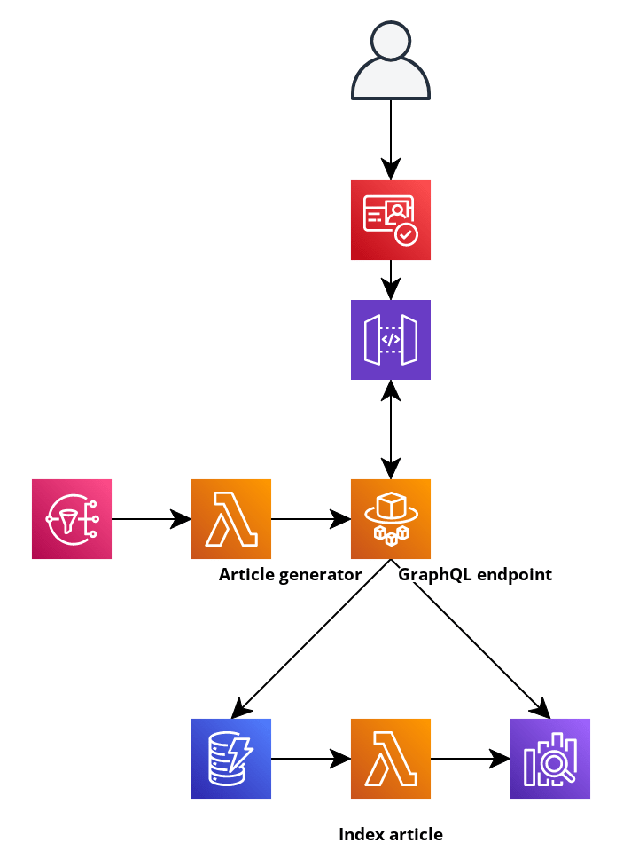

Trello board = https://trello.com/b/RsWU2a6x/aws-sam-competence-project

Requires a set of aws credentials set up in the aws credentials file with the profile name `aws-sam-practice-app`

Deploy from the CLI

```
sam deploy --region eu-west-1 --profile aws-sam-practice-app --stack-name aws-sam-practice-app --resolve-s3 --capabilities CAPABILITY_IAM
```

Destroying from the CLI

```
sam delete --stack-name aws-sam-practice-app --profile aws-sam-practice-app
```

# Architecture



## Spring Boot App with GraphQL Endpoint

The main component of the app, and must allow users to

- add articles
- delete articles
- edit articles
- view articles
- search for articles

It has direct access to the DynamoDB database and to OpenSearch.

It will be deployed through ECS/Fargate, allowing it to be easily scaled as necessary.

## Automatic creation of articles

This is made up of two parts.

### Article generator Lambda

Triggering this will create an article with fake data in it using something
like [DataFaker](https://github.com/DiUS/java-faker).

### EventBridge

Triggers the lambda at regular intervals to simulate users creating and adding articles to the database.

## DynamoDB

The main datastore for articles. Making changes here should trigger a Lambda to add index/reindex articles
in OpenSearch.

## Article search

OpenSearch will be used to implement article searches. When changes are made to the database, these will need to be
reflected in OpenSearch. I _think_ this can be done by using DynamoDB Streams and a Lambda, but we will need to
investigate this further.
