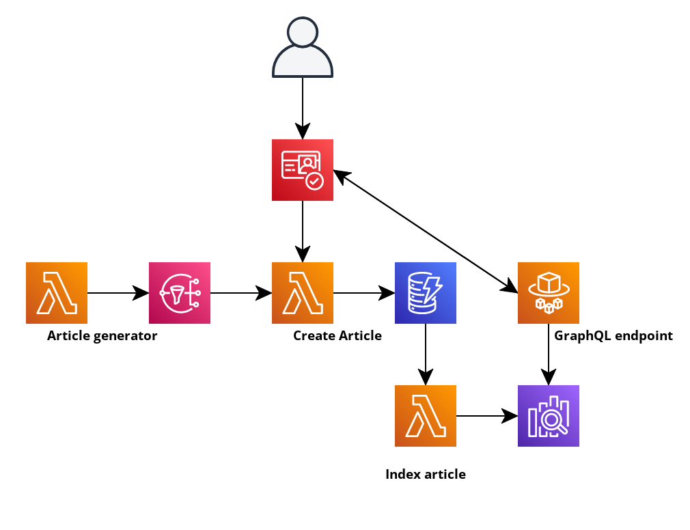

AWS account ID = 857952748331
Trello board = https://trello.com/b/RsWU2a6x/aws-sam-competence-project
Requires a set of aws credentials set up in the aws credentials file with the profile name `aws-sam-practice-app`
Deploy from the CLI
```sam deploy --region eu-west-1 --profile aws-sam-practice-app --stack-name aws-sam-practice-app --resolve-s3 --capabilities CAPABILITY_IAM```

`# Architecture

